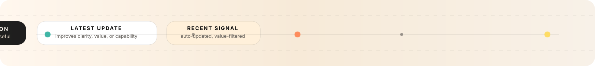

# Avivly

  

  Building healthcare AI, agent systems, and evidence-backed products with a bias toward clarity, utility, and a bit of controlled chaos.

  <a href="https://github.com/avivlyweb?tab=repositories">Repositories</a> ·
  <a href="https://github.com/avivlyweb?tab=stars">Stars</a> ·
  <a href="https://github.com/avivlyweb?tab=followers">Followers</a>

  

## Latest Signal

<!--LATEST-SIGNAL-START-->
<table>
  <tr>
    <td width="50%" valign="top">
      <h3>Latest creation</h3>
      
<strong><a href="https://github.com/avivlyweb/prettig-thuis">prettig-thuis</a></strong> 
      A calm, trust-heavy Base44 app for care, routines, and home support.

      
Last public signal: Apr 30, 2026

    </td>
    <td width="50%" valign="top">
      <h3>Latest meaningful update</h3>
      
<strong><a href="https://github.com/avivlyweb/pubmed-gemini-extension">pubmed-gemini-extension</a></strong> 
      A stronger research layer for PubMed workflows, aimed at high-signal medical search and evidence handling.

      
Last public signal: Mar 22, 2026

    </td>
  </tr>
</table>
<!--LATEST-SIGNAL-END-->

  

## What I Build

<table>
  <tr>
    <td valign="top" width="33%">
      <h3>Healthcare AI</h3>
      
Tools that make care, research, and clinical workflows easier to understand and easier to use.

    </td>
    <td valign="top" width="33%">
      <h3>Agent Systems</h3>
      
Multi-agent flows, orchestration patterns, and lab-style demos that show how the system thinks.

    </td>
    <td valign="top" width="33%">
      <h3>Evidence to Product</h3>
      
Turning research, notes, and complex context into products people can actually move with.

    </td>
  </tr>
</table>

  

## Selected Work

| Project | Why it matters |
| --- | --- |
| [pubmed-gemini-extension](https://github.com/avivlyweb/pubmed-gemini-extension) | PubMed research tooling with a sharper evidence workflow. |
| [pubmed-claude-plugin](https://github.com/avivlyweb/pubmed-claude-plugin) | A focused plugin layer for medical research analysis in Claude. |
| [crisp-dashboard](https://github.com/avivlyweb/crisp-dashboard) | Multi-agent clinical reasoning visualized as a product, not a chart dump. |
| [a-proof-demo](https://github.com/avivlyweb/a-proof-demo) | Voice and classification demo with a clear healthcare use case. |
| [token-optimizer](https://github.com/avivlyweb/token-optimizer) | Practical context-window discipline for long agent workflows. |
| [prettig-thuis](https://github.com/avivlyweb/prettig-thuis) | A more human front door for home-care and support scenarios. |

## Live Lab Feed

<!--LIVE-LAB-FEED-START-->
> Auto-refreshed from public repo activity on Jul 2, 2026. Recency is filtered for signal, not just noise.

| Repo | What changed matters | Signal | Updated |
| --- | --- | --- | --- |
| [feedback-ready-Canvas-E-I](https://github.com/avivlyweb/feedback-ready-Canvas-E-I) | feedback tool ready Canvas E&I | recent public work | Jun 30, 2026 |
| [a-proof-demo](https://github.com/avivlyweb/a-proof-demo) | Base44 App: A-PROOF Demo | proof, demo | Jun 12, 2026 |
| [pubmed-gemini-extension](https://github.com/avivlyweb/pubmed-gemini-extension) | PubMed MCP server for Gemini CLI - PhD-level medical research analysis | pubmed, research | Mar 22, 2026 |
| [nagomi-pubmed-plugin](https://github.com/avivlyweb/nagomi-pubmed-plugin) | Forensic-grade PubMed research engine — Claude Code plugin | pubmed, research | Feb 27, 2026 |
| [pubmed-claude-plugin](https://github.com/avivlyweb/pubmed-claude-plugin) | PhD-level PubMed medical research plugin for Claude Code. Search 35M+ studies, evidence-weighted verdicts, ABC-TOM v3.0 citation verification, and systematic evidence synthesis. | pubmed, research | Feb 19, 2026 |
| [aproof-demo](https://github.com/avivlyweb/aproof-demo) | A-PROOF voice demo — live ICF domain classification from Dutch speech (VU Amsterdam/CLTL) | proof, voice | Feb 16, 2026 |
<!--LIVE-LAB-FEED-END-->

## Current Focus

- Building products that feel more like designed systems than throwaway demos.
- Keeping healthcare work trustworthy, legible, and useful.
- Making agent tooling visible enough that the thinking is part of the product.

  

## Contact

  Reach me through GitHub issues, repo discussions, or the profile links above.

